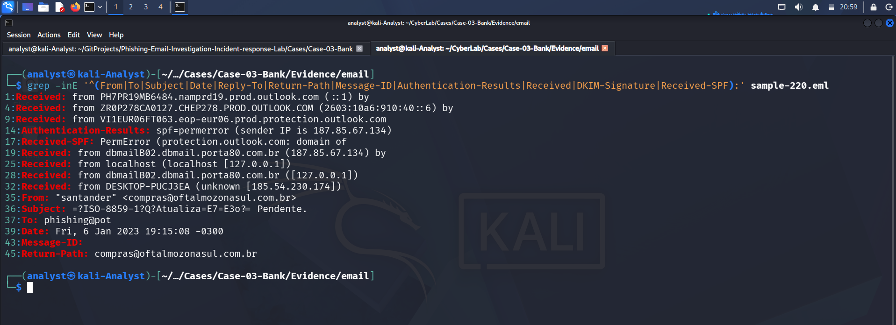

# Header Analysis

## Objective

The objective of the header analysis phase is to examine the technical metadata contained within the suspicious email and identify indicators related to sender identity, message handling, authentication, and potential inconsistencies.

The analysis was performed against the preserved original email evidence:

`sample-220.eml`

No modifications were made to the original evidence file.

---

## Evidence Examined

| Item | Details |
|---|---|
| Case ID | Case-03-Bank |
| Evidence File | `sample-220.eml` |
| Evidence Type | Suspicious / Phishing Email |
| Analysis Phase | Header Analysis |
| Analysis Environment | Kali Linux |
| Email Client | Mozilla Thunderbird |
| Evidence Integrity | Preserved original `.eml` |
| Primary Analysis Method | Raw email header examination |

---

## Header Extraction

The email headers were extracted directly from the preserved `.eml` file using command-line analysis.

The following command was used:

```bash
grep -inE '^(From|To|Subject|Date|Reply-To|Return-Path|Message-ID|Authentication-Results|Received|DKIM-Signature|Received-SPF):' sample-220.eml
````

The extraction identified the following important header fields:

```text
From: "santander" <compras@oftalmozonasul.com.br>
Subject: =?ISO-8859-1?Q?Atualiza=E7=E3o?= Pendente.
To: phishing@pot
Date: Fri, 6 Jan 2023 19:15:08 -0300
Return-Path: compras@oftalmozonasul.com.br
```

The message also contained multiple `Received:` headers and authentication-related headers.

### Evidence Screenshot



---

## Sender Header

The visible sender was:

```text
From: "santander" <compras@oftalmozonasul.com.br>
```

The display name claims to represent Santander, while the actual email address uses the domain:

```text
oftalmozonasul.com.br
```

This domain does not correspond to the Santander brand represented by the display name.

This is a significant header-level impersonation indicator because the display name and the underlying sender domain do not establish an obvious relationship.

The sender identity therefore requires further investigation during the Sender Analysis phase.

---

## Recipient

The message was addressed to:

```text
To: phishing@pot
```

The recipient address is consistent with the controlled phishing-analysis environment in which the email was collected.

No evidence from the header indicates that the message was originally addressed to a legitimate Santander customer.

---

## Subject

The subject header was recorded as:

```text
Subject: =?ISO-8859-1?Q?Atualiza=E7=E3o?= Pendente.
```

The encoded portion corresponds to:

```text
Atualização Pendente.
```

The meaning is approximately:

```text
Pending Update.
```

The subject therefore presents the message as an account or service update notification.

The subject wording is consistent with the social-engineering theme identified during the initial visual inspection.

---

## Date and Time

The message contains:

```text
Date: Fri, 6 Jan 2023 19:15:08 -0300
```

The timestamp includes an explicit `-0300` timezone offset.

The message was subsequently processed through additional mail infrastructure, including Microsoft mail protection infrastructure.

The detailed relationship between the timestamps and mail servers will be examined during the Routing Analysis phase.

---

## Return-Path

The message contains:

```text
Return-Path: compras@oftalmozonasul.com.br
```

The Return-Path matches the visible sender address:

```text
compras@oftalmozonasul.com.br
```

However, both addresses belong to the `oftalmozonasul.com.br` domain while the visible display name claims to represent Santander.

Therefore, the matching `From` and `Return-Path` values do not eliminate the impersonation concern.

---

## Message-ID

The message contains a Message-ID associated with Microsoft mail infrastructure:

```text
Message-ID:
<e49b2610-4c6b-43fd-b54a-1738825976af@VI1EUR06FT063.eop-eur06.prod.protection.outlook.com>
```

The Message-ID alone does not establish that the sender is legitimate.

It indicates that the message was processed through infrastructure associated with Microsoft email protection services.

The Message-ID should therefore be treated as supporting metadata rather than proof of sender authenticity.

---

## Authentication Results

The message contains the following authentication result:

```text
Authentication-Results: spf=permerror (sender IP is 187.85.67.134)
```

The same authentication block identifies:

```text
smtp.mailfrom=oftalmozonasul.com.br
```

and:

```text
dkim=none (message not signed)
```

It also contains:

```text
header.d=none;
dmarc=temperror;
action=none
```

Therefore, the observed authentication results are:

| Authentication Mechanism | Result      |
| ------------------------ | ----------- |
| SPF                      | `permerror` |
| DKIM                     | `none`      |
| DMARC                    | `temperror` |
| DMARC Action             | `none`      |

These results do not provide positive evidence that the message was authenticated as an authorized Santander communication.

---

## SPF Analysis

The message contains:

```text
Received-SPF: PermError
```

The authentication results identify the sender IP as:

```text
187.85.67.134
```

The SPF mechanism therefore did not produce a valid authentication result.

A `PermError` indicates that SPF evaluation encountered a permanent configuration or evaluation problem rather than producing a normal pass/fail result.

This is a significant authentication anomaly and requires consideration alongside the sender-domain mismatch.

---

## DKIM Analysis

The authentication results contain:

```text
dkim=none (message not signed)
```

No valid DKIM signature was identified in the available authentication results.

Therefore, there is no DKIM-based cryptographic evidence in the analyzed headers establishing that the message content was authorized by the claimed sender domain.

---

## DMARC Analysis

The authentication results contain:

```text
dmarc=temperror
```

The recorded DMARC result was therefore not a successful authentication result.

The header also records:

```text
action=none
```

This means the available header evidence does not demonstrate successful DMARC authentication for the message.

The DMARC result will be considered together with the sender domain and authentication results during the later Sender Analysis and Threat Intelligence phases.

---

## Received Header Presence

The message contains multiple `Received:` headers.

The extracted entries include:

```text
Received: from PH7PR19MB6484.namprd19.prod.outlook.com (::1) by ...
Received: from ZR0P278CA0127.CHEP278.PROD.OUTLOOK.COM (2603:10a6:910:40::6) by ...
Received: from VI1EUR06FT063.eop-eur06.prod.protection.outlook.com ...
Received: from dbmailB02.dbmail.porta80.com.br (187.85.67.134) by ...
Received: from localhost (localhost [127.0.0.1])
Received: from dbmailB02.dbmail.porta80.com.br ([127.0.0.1])
Received: from DESKTOP-PUCJ3EA (unknown [185.54.230.174])
```

These headers establish that the message passed through multiple mail-processing systems.

The presence of the external IP address:

```text
187.85.67.134
```

and the originating-looking host entry:

```text
DESKTOP-PUCJ3EA (unknown [185.54.230.174])
```

are particularly relevant.

However, the exact chronological interpretation of the `Received:` chain is intentionally reserved for the Routing Analysis phase.

---

## Header Anomalies Identified

The following anomalies were identified during header analysis.

### 1. Brand and Domain Mismatch

The display name claims:

```text
"santander"
```

while the sender address is:

```text
compras@oftalmozonasul.com.br
```

This represents a clear discrepancy between the claimed brand identity and the actual sender domain.

### 2. SPF PermError

The authentication results contain:

```text
spf=permerror
```

and:

```text
Received-SPF: PermError
```

This means SPF authentication did not produce a valid result.

### 3. No DKIM Signature

The authentication results contain:

```text
dkim=none
```

No DKIM-based authentication evidence was identified.

### 4. DMARC TempError

The authentication results contain:

```text
dmarc=temperror
```

Therefore, DMARC authentication did not produce a successful result.

### 5. External Sender Infrastructure

The headers identify:

```text
187.85.67.134
```

and:

```text
185.54.230.174
```

These addresses require further investigation.

---

## Header-Level Assessment

Based solely on the header evidence, the email presents several indicators consistent with a suspected phishing or brand-impersonation message.

The strongest header-level indicators are:

* The display name claims to represent Santander.
* The actual sender domain is `oftalmozonasul.com.br`.
* SPF returned `PermError`.
* No DKIM signature was identified.
* DMARC returned `TempError`.
* The message contains multiple external and internal mail-routing entries.
* The headers identify external IP addresses that require further analysis.

The header evidence therefore supports treating the message as suspicious.

However, header analysis alone does not establish the complete attack path or determine whether the identified infrastructure is malicious.

Those questions require further analysis of the routing chain, sender infrastructure, message content, URLs, and other indicators.

---

## Evidence Screenshots

### Header Extraction


### Thunderbird Raw Header View


### Authentication Header Summary


---

## Findings Summary

| Finding          | Observation                     | Assessment                               |
| ---------------- | ------------------------------- | ---------------------------------------- |
| Claimed Brand    | Santander                       | Suspicious                               |
| Sender Domain    | `oftalmozonasul.com.br`         | Brand/domain mismatch                    |
| Return-Path      | `compras@oftalmozonasul.com.br` | Matches sender address                   |
| SPF              | `PermError`                     | Authentication anomaly                   |
| DKIM             | `none`                          | No DKIM authentication                   |
| DMARC            | `TempError`                     | Authentication anomaly                   |
| Sender IP        | `187.85.67.134`                 | Requires routing/infrastructure analysis |
| Additional IP    | `185.54.230.174`                | Requires routing/infrastructure analysis |
| Received Headers | Multiple hops present           | Requires routing analysis                |

---

## Conclusion

The header analysis identified multiple indicators that are inconsistent with a straightforward legitimate Santander communication.

The most significant observation is the mismatch between the claimed sender identity:

```text
"santander"
```

and the actual sender domain:

```text
oftalmozonasul.com.br
```

The message also failed to provide positive authentication evidence, with SPF reporting `PermError`, DKIM reporting `none`, and DMARC reporting `TempError`.

These findings increase the confidence that the message requires further phishing investigation.

The identified `Received:` chain and IP addresses will be examined separately during the Routing Analysis phase to reconstruct the message path and identify the relevant mail infrastructure.

---

## Phase Status

**Phase 02 — Header Analysis: COMPLETE**

The technical email headers have been extracted, preserved, examined, and documented.

The investigation will now proceed to:

**Phase 03 — Routing Analysis**

