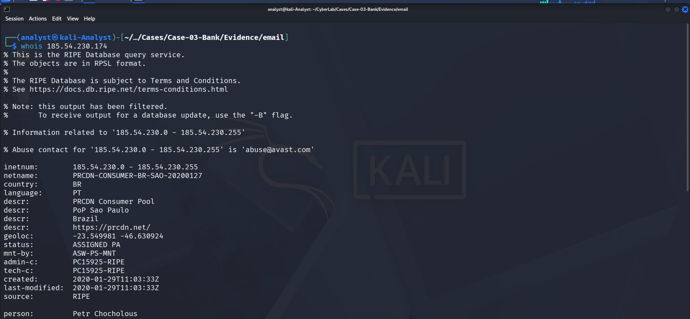

# Routing Analysis

## Objective

The objective of the routing analysis phase is to reconstruct the email's transmission path from the preserved `Received:` headers and identify the infrastructure involved in delivering the message.

This phase focuses on determining:

- The originating IP address
- The originating host
- The intermediate mail server
- Microsoft mail infrastructure involved in delivery
- Network ownership and registration information
- DNS resolution status
- IP reputation / blacklist status
- Any inconsistencies between the historical email headers and current DNS information

All analysis was performed using the preserved email evidence without modifying or interacting with the original message.

---

## Evidence Examined

| Item | Details |
|---|---|
| Case ID | `Case-03-Bank` |
| Evidence File | `sample-220.eml` |
| Evidence Type | Phishing Email |
| Analysis Phase | Routing Analysis |
| Primary Evidence | `Received:` header chain |
| Originating IP | `185.54.230.174` |
| Mail Server IP | `187.85.67.134` |
| Mail Server | `dbmailB02.dbmail.porta80.com.br` |
| External Infrastructure | Microsoft Outlook / Office 365 |
| WHOIS / RDAP Source | RIPE Database |
| Reputation Source | MXToolbox |
| DNS Analysis | `dig` |
| Interaction with Infrastructure | Passive / non-invasive |

---

## 1. Received Header Chain

The preserved email contains multiple `Received:` headers that provide the primary evidence for reconstructing the message's routing path.

The following entries were extracted from `sample-220.eml`:

```text
Received: from PH7PR19MB6484.namprd19.prod.outlook.com (::1) by
DM4PR19MB6317.namprd19.prod.outlook.com with HTTPS

Received: from ZR0P278CA0127.CHEP278.PROD.OUTLOOK.COM
(2603:10a6:910:40::6) by
PH7PR19MB6484.namprd19.prod.outlook.com

Received: from VI1EUR06FT063.eop-eur06.prod.protection.outlook.com
(2603:10a6:910:40:cafe::aa) by
ZR0P278CA0127.outlook.office365.com

Received: from dbmailB02.dbmail.porta80.com.br
(187.85.67.134) by
VI1EUR06FT063.mail.protection.outlook.com

Received: from localhost (localhost [127.0.0.1])
by dbmailB02.dbmail.porta80.com.br

Received: from dbmailB02.dbmail.porta80.com.br ([127.0.0.1])
by localhost (dbmailB02.dbmail.porta80.com.br [127.0.0.1])

Received: from DESKTOP-PUCJ3EA (unknown [185.54.230.174])
by dbmailB02.dbmail.porta80.com.br (Postfix)
````

The earliest externally meaningful source shown in the preserved chain is:

```text
185.54.230.174
```

The next mail-handling system identified in the chain is:

```text
dbmailB02.dbmail.porta80.com.br
```

with IP address:

```text
187.85.67.134
```

### Routing Interpretation

The header sequence indicates the following progression:

```text
185.54.230.174
        |
        v
DESKTOP-PUCJ3EA
        |
        v
dbmailB02.dbmail.porta80.com.br
187.85.67.134
        |
        v
Microsoft Exchange / Outlook Protection
        |
        v
Microsoft Outlook / Office 365
        |
        v
Recipient mailbox
```

The `Received:` headers therefore provide evidence that the message entered the mail path from `185.54.230.174`, was accepted by the `dbmailB02.dbmail.porta80.com.br` mail server, and was subsequently processed through Microsoft mail infrastructure.

---

## 2. Originating IP Analysis

The earliest non-local IP address identified in the routing chain is:

```text
185.54.230.174
```

The corresponding header entry is:

```text
Received: from DESKTOP-PUCJ3EA (unknown [185.54.230.174])
by dbmailB02.dbmail.porta80.com.br (Postfix)
```

This is significant because the header identifies the sending host as:

```text
DESKTOP-PUCJ3EA
```

while the hostname is explicitly reported as:

```text
unknown
```

The IP address therefore provides the primary network-level indicator for the earliest visible sending system in the preserved header chain.

---

## 3. RIPE Network Registration Analysis

A RIPE Database lookup was performed for:

```text
185.54.230.174
```

The returned registration information identified the address as part of:

```text
inetnum: 185.54.230.0 - 185.54.230.255
netname: PRCDN-CONSUMER-BR-SAO-20200127
country: BR
language: PT
descr: PRCDN Consumer Pool
descr: PoP Sao Paulo
descr: Brazil
status: ASSIGNED PA
```

The displayed network information also included:

```text
mnt-by: ASW-PS-MNT
admin-c: PC15925-RIPE
tech-c: PC15925-RIPE
source: RIPE
```

The RIPE result displayed the following geolocation coordinates:

```text
-23.549981 -46.630924
```

The registration information therefore associates the address range with a consumer network pool and identifies a São Paulo point of presence in Brazil.

### Interpretation

The RIPE record indicates that `185.54.230.174` belongs to a registered consumer-network address range associated with the São Paulo PoP in Brazil.

This information should be interpreted as network-registration and infrastructure context.

It does not independently identify the individual user, physical device, or threat actor responsible for sending the email.

The RIPE result also displayed:

```text
Abuse contact: abuse@avast.com
```

The presence of this address in the database record represents the registered abuse contact and does not establish that the organization associated with that address sent, controlled, or participated in the email activity.



---

## 4. Mail Server Analysis

The next significant system in the routing chain is:

```text
dbmailB02.dbmail.porta80.com.br
```

The corresponding IP address recorded in the email header is:

```text
187.85.67.134
```

The relevant header entry is:

```text
Received: from dbmailB02.dbmail.porta80.com.br (187.85.67.134) by
VI1EUR06FT063.mail.protection.outlook.com
```

This establishes that the system identified as `dbmailB02.dbmail.porta80.com.br` handed the message to Microsoft's mail-protection infrastructure.

The same server also appears in the local delivery portion of the header chain:

```text
Received: from localhost (localhost [127.0.0.1])
by dbmailB02.dbmail.porta80.com.br (Postfix)

Received: from dbmailB02.dbmail.porta80.com.br ([127.0.0.1])
by localhost (dbmailB02.dbmail.porta80.com.br [127.0.0.1])
```

These entries show local processing through the mail server before the message was passed externally.

---

## 5. Mail Server IP Analysis

The mail server IP identified from the `Received:` headers is:

```text
187.85.67.134
```

A WHOIS lookup was performed against the address.

The network information identified the address as belonging to:

```text
inetnum: 187.85.64.0/20
aut-num: AS53060
owner: Porta 80 - Servicos em Internet Ltda
responsible: Porta 80 Web Hosting
```

The relevant network range shown was:

```text
187.85.64.0/20
```

The associated administrative information included:

```text
owner-c: POWHO
tech-c: POWHO
```

The WHOIS result therefore associates `187.85.67.134` with infrastructure registered to:

```text
Porta 80 - Servicos em Internet Ltda
```

### Interpretation

The WHOIS information provides ownership and registration context for the mail-server IP.

It does not, by itself, establish who controlled the mailbox, who authored the phishing message, or whether the infrastructure provider was aware of the activity.

---

## 6. DNS Analysis of Mail Server

A DNS A-record lookup was performed against:

```text
dbmailB02.dbmail.porta80.com.br
```

Command used:

```bash
dig A dbmailB02.dbmail.porta80.com.br
```

The query returned:

```text
status: SERVFAIL
```

with:

```text
ANSWER: 0
```

The DNS server used for the query was:

```text
203.153.41.28
```

The result therefore did not provide a current A record for:

```text
dbmailB02.dbmail.porta80.com.br
```

### Interpretation

The failed DNS lookup is important because the hostname appears directly in the historical email headers, while the current DNS query does not return an A record.

This may indicate that the hostname is no longer publicly resolvable, that its DNS configuration has changed, or that the queried DNS infrastructure was unable to obtain an authoritative response at the time of testing.

The `SERVFAIL` result should therefore **not** be interpreted as proof that the historical mail server never existed.

The historical `Received:` headers remain the primary evidence that the hostname and IP address were present in the email's routing path.


---

## 7. MXToolbox Analysis — Originating IP

The originating IP:

```text
185.54.230.174
```

was checked using MXToolbox's blacklist lookup.

The result displayed:

```text
Checking 185.54.230.174 against 60 known blacklists...
Listed 0 times with 0 timeouts
```

The displayed blacklist checks returned `OK` for the tested services.


### Interpretation

At the time of the MXToolbox lookup, the originating IP was not listed on the tested blacklists.

This is a reputation observation only.

A clean blacklist result does **not** establish that an email is legitimate, nor does it eliminate the possibility of phishing activity.

---

## 8. MXToolbox Analysis — Mail Server IP

The mail-server IP:

```text
187.85.67.134
```

was also checked against MXToolbox's blacklist databases.

The result displayed:

```text
Checking 187.85.67.134 against 60 known blacklists...
Listed 0 times with 0 timeouts
```

The tested blacklist services displayed `OK`.


### Interpretation

The mail-server IP was not listed on the tested blacklists at the time of the lookup.

Again, blacklist status is a reputation indicator and should not be treated as a determination of legitimacy.

---

## 9. MXToolbox DNS / MX Analysis

An MXToolbox lookup was also performed against:

```text
dbmailB02.dbmail.porta80.com.br
```

The lookup returned:

```text
DNS Record Published: DNS Record not found
```

The related checks displayed:

```text
DMARC Record Published: No DMARC Record found
DMARC Policy Not Enabled
BIMI Record Published: Brand Logo not appearing in inboxes
```


### Interpretation

The current MXToolbox result did not identify a published DNS record for the historical mail-server hostname.

The absence of a current DNS record is consistent with the earlier `dig` result that returned `SERVFAIL`.

The missing DMARC record reported by MXToolbox is additional current DNS information about the queried hostname and should not be confused with the authentication results contained in the original email itself.

---

## 10. Routing Timeline

Based on the preserved `Received:` headers, the routing sequence can be summarized as follows:

| Stage | System                           | Address / Information                                 |
| ----- | -------------------------------- | ----------------------------------------------------- |
| 1     | Earliest visible sender          | `DESKTOP-PUCJ3EA`                                     |
| 2     | Originating IP                   | `185.54.230.174`                                      |
| 3     | Mail server                      | `dbmailB02.dbmail.porta80.com.br`                     |
| 4     | Mail server IP                   | `187.85.67.134`                                       |
| 5     | Microsoft protection layer       | `VI1EUR06FT063.eop-eur06.prod.protection.outlook.com` |
| 6     | Microsoft Exchange / Outlook     | `ZR0P278CA0127`                                       |
| 7     | Microsoft mailbox infrastructure | `PH7PR19MB6484` / `DM4PR19MB6317`                     |

The routing path can therefore be represented as:

```text
DESKTOP-PUCJ3EA
        |
        | 185.54.230.174
        v
dbmailB02.dbmail.porta80.com.br
        |
        | 187.85.67.134
        v
Microsoft Exchange Online Protection
        |
        v
Microsoft Outlook / Office 365
        |
        v
Recipient mailbox
```

---

## 11. Routing Findings

The routing analysis produced the following findings:

1. The earliest externally visible IP address in the preserved `Received:` chain is `185.54.230.174`.

2. The corresponding sending host is identified as `DESKTOP-PUCJ3EA`, while the hostname is reported as `unknown`.

3. The originating IP belongs to a registered address range identified by RIPE as `PRCDN-CONSUMER-BR-SAO-20200127`.

4. The RIPE registration describes the network as a `PRCDN Consumer Pool` with a `PoP Sao Paulo` in Brazil.

5. The next significant mail system is `dbmailB02.dbmail.porta80.com.br`.

6. The mail server IP recorded in the header is `187.85.67.134`.

7. WHOIS information associates the `187.85.64.0/20` network with `Porta 80 - Servicos em Internet Ltda`.

8. The message was subsequently processed through Microsoft Outlook / Office 365 mail infrastructure.

9. Current DNS testing of `dbmailB02.dbmail.porta80.com.br` returned `SERVFAIL` with no A-record answer.

10. MXToolbox reported that `185.54.230.174` was listed `0` times across the tested blacklists.

11. MXToolbox also reported that `187.85.67.134` was listed `0` times across the tested blacklists.

12. MXToolbox reported that no current DNS record was found for `dbmailB02.dbmail.porta80.com.br`.

13. The current DNS and blacklist results do not invalidate the historical routing evidence contained in the preserved email headers.

---

## 12. Routing Assessment

The routing evidence demonstrates that the suspicious message did not originate directly from Microsoft's mail infrastructure.

The earliest visible source in the preserved header chain is:

```text
185.54.230.174
```

which was associated with:

```text
DESKTOP-PUCJ3EA
```

and subsequently passed through:

```text
dbmailB02.dbmail.porta80.com.br
```

before entering Microsoft mail infrastructure.

The network-registration information provides additional context about the originating IP and the mail-server IP, while the DNS and MXToolbox results provide current infrastructure and reputation observations.

The evidence is consistent with a message that was transmitted through external mail infrastructure before being processed by Microsoft.

However, routing evidence alone does not establish the identity of the individual responsible for the email.

---

## Conclusion

The routing analysis successfully reconstructed the observable transmission path of `sample-220.eml`.

### Key Routing Indicators

| Indicator                  | Value                             |
| -------------------------- | --------------------------------- |
| Originating IP             | `185.54.230.174`                  |
| Originating Host           | `DESKTOP-PUCJ3EA`                 |
| Mail Server                | `dbmailB02.dbmail.porta80.com.br` |
| Mail Server IP             | `187.85.67.134`                   |
| Destination Infrastructure | Microsoft Outlook / Office 365    |

The historical `Received:` headers provide the primary evidence for this routing chain.

External WHOIS, RIPE, DNS, and MXToolbox lookups were used as supporting infrastructure context.

The routing phase does not independently prove attribution to a specific individual or organization. Authentication results, sender analysis, URL analysis, and content analysis must be considered together with the routing evidence before reaching the final incident assessment.

---

## Screenshots

The following screenshots document the routing-analysis activities performed during this phase:

### Originating IP / RIPE Analysis


### DNS Analysis


### MXToolbox — Originating IP


### MXToolbox — Mail Server IP


### MXToolbox — Mail Server Host


