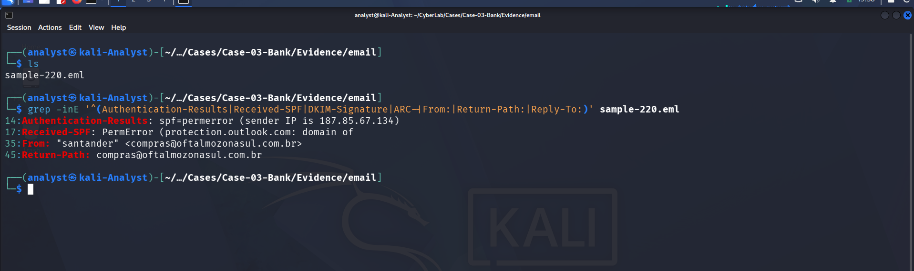
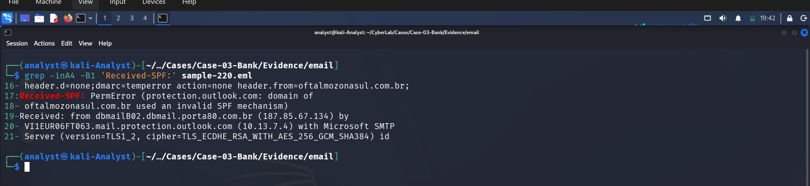
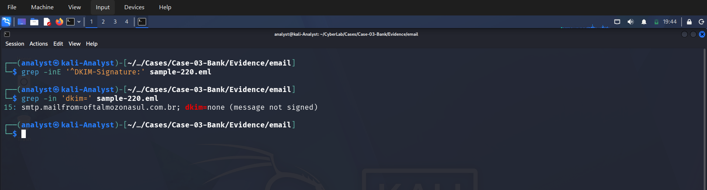
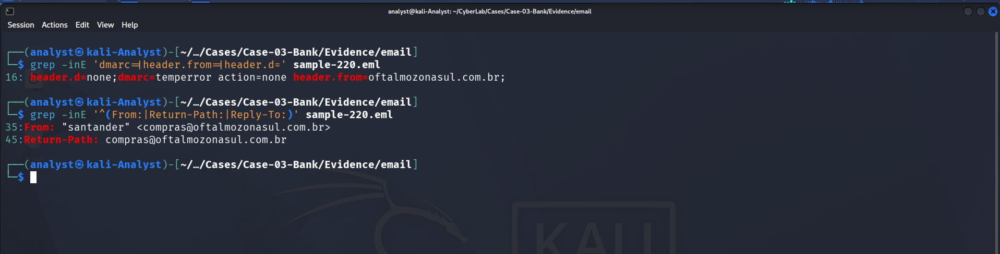

# Authentication Analysis

## Case 03 — Bank Email Investigation

**Phase:** Email Authentication Analysis  
**Evidence File:** `sample-220.eml`  
**Analysis Type:** SPF, DKIM, DMARC, and Header Identity Validation

---

## 1. Objective

The objective of this phase was to analyze the email authentication mechanisms present in `sample-220.eml` and determine whether the sender's identity could be cryptographically or DNS-validated.

The following authentication mechanisms were examined:

- SPF (Sender Policy Framework)
- DKIM (DomainKeys Identified Mail)
- DMARC (Domain-based Message Authentication, Reporting, and Conformance)
- `From:` header
- `Return-Path:` header
- Sending IP address
- Authentication results generated by the receiving mail infrastructure

---

## 2. Evidence File

The analysis was performed against the original email evidence:

```text
sample-220.eml
````

The relevant authentication headers were extracted using:

```bash
grep -inE '^(Authentication-Results|Received-SPF|DKIM-Signature|ARC-|From:|Return-Path:)' sample-220.eml
```

### Evidence



---

# 3. Authentication-Results Analysis

The following `Authentication-Results` header was identified:

```text
Authentication-Results: spf=permerror (sender IP is 187.85.67.134)
smtp.mailfrom=oftalmozona sul.com.br; dkim=none (message not signed)
header.d=none; dmarc=temperror action=none header.from=oftalmozona sul.com.br;
```

> Note: The domain is reproduced as observed in the email evidence. Formatting/line wrapping may differ depending on terminal output.

The authentication results indicate failures or absence of all three major email authentication mechanisms.

---

## 4. SPF Analysis

### Observed Result

```text
spf=permerror
```

The receiving infrastructure reported:

```text
sender IP is 187.85.67.134
```

The associated envelope sender was:

```text
smtp.mailfrom=oftalmozona sul.com.br
```

The `Received-SPF` header provided additional detail:

```text
Received-SPF: PermError
(protection.outlook.com: domain of
oftalmozonasul.com.br used an invalid SPF mechanism)
```

### Interpretation

The SPF check did **not** produce a valid authorization result.

Instead, the receiving Microsoft infrastructure reported a **Permanent Error (`PermError`)**, specifically indicating that the domain's SPF configuration contained an invalid SPF mechanism.

Therefore, the sending IP:

```text
187.85.67.134
```

could not be successfully validated against a valid SPF policy for the sender domain.

### Finding

**SPF Status: FAILED / PERMANENT ERROR**

This means SPF could not be reliably used to authenticate the sending infrastructure.

---

### Evidence



---

# 5. DKIM Analysis

A search for a DKIM signature was performed using:

```bash
grep -inE '^DKIM-Signature:' sample-220.eml
```

No `DKIM-Signature` header was present.

The `Authentication-Results` header also explicitly reported:

```text
dkim=none (message not signed)
```

### Interpretation

The email was **not digitally signed using DKIM**.

As a result:

* There was no DKIM signature to validate.
* The message content could not be cryptographically associated with the claimed sending domain through DKIM.
* There was no DKIM-based integrity/authenticity validation available.

### Finding

**DKIM Status: NONE**

The message was not DKIM-signed.

---

### Evidence



---

# 6. DMARC Analysis

The `Authentication-Results` header reported:

```text
dmarc=temperror
action=none
header.from=oftalmozona sul.com.br
```

### Interpretation

The DMARC evaluation encountered a **temporary error (`temperror`)**.

The result also indicates:

```text
action=none
```

Therefore, no DMARC enforcement action was applied to the message based on the recorded result.

The claimed identity in the visible `From:` header was:

```text
oftalmozonasul.com.br
```

However, because SPF returned a permanent error and DKIM was absent, there was no successful authentication mechanism available to establish alignment for the claimed domain.

### Finding

**DMARC Status: TEMPORARY ERROR**

**DMARC Action: NONE**

---

### Evidence



---

# 7. From Header Analysis

The visible sender identity was:

```text
From: "santander" <compras@oftalmozonasul.com.br>
```

This is significant because the display name:

```text
santander
```

does not correspond to the domain used by the email address:

```text
oftalmozonasul.com.br
```

The sender therefore presented itself using a recognizable financial institution's name while using a different domain in the actual email address.

### Finding

The message used a **brand-like display name** that was not consistent with the sender domain.

This is a relevant indicator when assessing possible impersonation or phishing activity.

---

### Evidence


---

# 8. Return-Path Analysis

The email contained:

```text
Return-Path: compras@oftalmozonasul.com.br
```

The envelope sender therefore matched the domain observed in the `From:` address:

```text
compras@oftalmozonasul.com.br
```

### Interpretation

The `From:` and `Return-Path:` domains were consistent with each other.

However, matching domains alone do **not** establish that the sender was legitimate.

SPF authentication for the envelope sender resulted in:

```text
spf=permerror
```

Therefore, the domain relationship could not be successfully authenticated through SPF.

### Finding

**Return-Path Domain: `oftalmozonasul.com.br`**

**SPF Validation: PermError**

---

### Evidence


---

# 9. Sending IP Analysis

The sending IP identified in the authentication results was:

```text
187.85.67.134
```

The relevant authentication result was:

```text
spf=permerror (sender IP is 187.85.67.134)
```

The `Received` header also recorded:

```text
Received: from dbmailB02.dbmail.porta80.com.br (187.85.67.134)
```

This establishes that the email infrastructure identified the sending host as:

```text
dbmailB02.dbmail.porta80.com.br
```

with IP:

```text
187.85.67.134
```

### Finding

**Observed Sending Host:**

```text
dbmailB02.dbmail.porta80.com.br
```

**Observed Sending IP:**

```text
187.85.67.134
```

---

### Evidence


---

# 10. Authentication Summary

| Authentication Component | Result                            | Observation                           |
| ------------------------ | --------------------------------- | ------------------------------------- |
| SPF                      | `PermError`                       | Invalid SPF mechanism reported        |
| DKIM                     | `None`                            | Message was not signed                |
| DMARC                    | `TempError`                       | DMARC evaluation encountered an error |
| DMARC Action             | `None`                            | No enforcement action recorded        |
| From Domain              | `oftalmozonasul.com.br`           | Claimed sender domain                 |
| Return-Path              | `compras@oftalmozonasul.com.br`   | Matches sender domain                 |
| Sending IP               | `187.85.67.134`                   | Observed sending infrastructure       |
| Sending Host             | `dbmailB02.dbmail.porta80.com.br` | Host identified in Received header    |
| Display Name             | `santander`                       | Brand-like sender display name        |

---

# 11. Key Findings

The authentication analysis produced the following findings:

### 11.1 SPF Authentication Failure

The sender domain produced an SPF **Permanent Error**.

```text
spf=permerror
```

The receiving infrastructure specifically reported that the domain used an invalid SPF mechanism.

---

### 11.2 No DKIM Signature

The message did not contain a `DKIM-Signature` header.

```text
dkim=none
```

Therefore, there was no cryptographic DKIM validation of the message.

---

### 11.3 DMARC Evaluation Error

DMARC returned:

```text
dmarc=temperror
```

with:

```text
action=none
```

No enforcement action was recorded.

---

### 11.4 Sender Identity Inconsistency

The email used:

```text
From: "santander" <compras@oftalmozonasul.com.br>
```

The display name suggests a well-known financial institution, while the actual sender domain is:

```text
oftalmozonasul.com.br
```

This discrepancy is relevant to the phishing/impersonation assessment.

---

### 11.5 Authentication Could Not Establish Sender Legitimacy

The three major authentication mechanisms did not provide a successful authentication chain:

```text
SPF   → PermError
DKIM  → None
DMARC → TempError
```

Consequently, the authentication evidence does not establish that the message was legitimately authorized by the claimed sender domain.

---

# 12. Authentication Assessment

Based solely on the observed email headers, the authentication posture of the message is **highly suspicious**.

The message exhibits the following characteristics:

```text
                 ┌─────────────────────────────┐
                 │       Email Message         │
                 └──────────────┬──────────────┘
                                │
             ┌──────────────────┼──────────────────┐
             │                  │                  │
             ▼                  ▼                  ▼
          SPF Check          DKIM Check         DMARC
             │                  │                  │
             ▼                  ▼                  ▼
         PermError             None            TempError
             │                  │                  │
             └──────────────────┼──────────────────┘
                                │
                                ▼
                   Authentication Failed /
                    Could Not Be Validated
```

The authentication results should therefore be considered a significant indicator when correlating this message with the other forensic evidence collected during the investigation.

---

# 13. Conclusion

The authentication analysis identified multiple weaknesses in the message's sender validation.

The email was sent from:

```text
187.85.67.134
```

and identified the sending host as:

```text
dbmailB02.dbmail.porta80.com.br
```

The claimed sender domain was:

```text
oftalmozonasul.com.br
```

However:

* SPF returned **PermError** due to an invalid SPF mechanism.
* DKIM was **not present**.
* DMARC returned **TempError** with **no enforcement action**.
* The visible sender used the display name **"santander"** while using the unrelated domain `oftalmozonasul.com.br`.

These results indicate that the email's claimed sender identity could **not be successfully authenticated** using the available email authentication mechanisms.

This authentication evidence should be correlated with the previously documented **header analysis** and **routing analysis** before reaching the final determination regarding the nature and origin of the email.

---

## 14. Evidence Preservation

The original email evidence was preserved as:

```text
sample-220.eml
```

All authentication findings in this phase were derived from the original message headers without modifying the evidence file.

### Primary Evidence

```text
Evidence/email/sample-220.eml
```

### Authentication Evidence

```text
Authentication-Results
Received-SPF
From
Return-Path
Received
DKIM-Signature (absence)
```

---

## 15. Next Phase

The next stage of the investigation is to correlate the authentication findings with the remaining forensic evidence and determine whether the observed sender infrastructure, domain, and message characteristics support a phishing or impersonation conclusion.

````

### Screenshot folder structure

For the Markdown above, keep your screenshots organized like this:

```text
Case-03-Bank/
├── Evidence/
│   └── email/
│       └── sample-220.eml
│
└── screenshots/
    ├── authentication-header-extraction.png
    ├── spf-permerror.png
    ├── dkim-none.png
    ├── dmarc-temperror.png
    ├── from-header.png
    ├── return-path.png
    └── sending-ip-host.png
````

